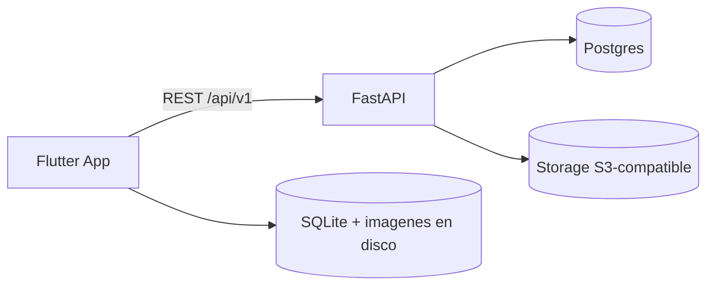

# Arquitectura PictoComm

Este documento ES la restriccion y definicion de arquitectura.
Todo diseno e implementacion DEBE conformarse a lo aqui definido.

Convenciones: **DEBE** = obligatorio, **NO DEBE** = prohibido,
**PUEDE** = permitido. Las verificaciones estan en cada seccion.

---

## 1. Restricciones innegociables

1. Frontend **DEBE** implementarse en **Flutter** (Android + iOS desde un solo codigo).
2. Backend **DEBE** implementarse en **FastAPI (Python 3.12+)** y distribuirse como
   **imagen Docker**. La misma imagen DEBE correr en Windows (dev), VPS y
   cualquier nube sin recodificar.
3. La app **DEBE** funcionar con conexion y **DEBE** seguir funcionando sin
   conexion con los ultimos datos cacheados (online-first con fallback, sec. 8).
4. El frontend **NO DEBE** acceder a bases de datos ni storage remotos.
   Solo consume la API por `REST + JSON` (sec. 7).
5. Toda configuracion de entorno **DEBE** leerse de variables de entorno
   (12-factor). **NO DEBE** haber rutas absolutas, credenciales ni URLs
   quemadas en el codigo.

Verificacion: un revisor puede rechazar cualquier PR que viole 1-5 sin mas argumento.

---

## 2. Estilo arquitectonico

- Sistema **cliente-servidor desacoplado**: app Flutter <-> API REST stateless.
- Backend: **monolito modular** (un deployable, modulos verticales por dominio).
  **NO DEBE** dividirse en microservicios.
- Frontend: **Clean Architecture ligera por feature** (sec. 4).
- Comunicacion sincrona `HTTP/JSON`. **NO DEBE** introducirse gRPC, GraphQL ni
  websockets .



---

## 3. Estructura del repositorio

```text
docs/architecture/architecture.md   # este archivo (normativo)
src/frontend/                       # app Flutter (sec. 4)
src/backend/                        # API FastAPI (sec. 5)
src/shared/openapi.yaml             # contrato congelado v1 (sec. 7)
overview.md                         # objetivo del producto (no normativo)
```

Regla: `src/frontend` y `src/backend` **NO DEBEN** importarse entre si.
El unico acople permitido es `src/shared/openapi.yaml`.

---

## 4. Frontend Flutter: modelo obligatorio

### 4.1 Arbol de archivos

```text
lib/
  main.dart
  app.dart
  core/
    constants/app_routes.dart
    di/injector.dart
    error/app_exception.dart
    theme/app_theme.dart
  features/
    catalog/
      domain/          # entidades + interfaces de repositorio (puro)
      data/            # models JSON + datasources + repos
      presentation/    # providers + screens + widgets
    profiles/          # misma estructura
```

### 4.2 Reglas de dependencia

```text
presentation -> domain <- data
core NO importa features. domain NO importa Flutter (salvo dart:ui Color).
```

- `presentation/` **DEBE** depender solo de interfaces de `domain/`.
  **NO DEBE** importar `data/`.
- `data/` **DEBE** implementar las interfaces de `domain/` y traducir
  errores HTTP a `AppException`. **NO DEBE** filtrar logica de negocio a widgets.
- `domain/` **NO DEBE** conocer assets, SharedPreferences, HTTP ni SQLite.

### 4.3 Vocabulario de dominio (obligatorio)

| Concepto | Tipo | Notas |
|---|---|---|
| `Picto` | entidad | Imagen que toca el nino. Campos sec. 6. **NO DEBE** usarse `Symbol` (colisiona con `dart:core`). |
| `PictoSource` | enum | `bundled` / `custom` / `remote`. El `switch` de render vive en un solo widget (`PictoCard`). |
| `Category` | entidad | Grupo de pictos. Importar Flutter con `hide Category` si colisiona. |
| `ChildProfile` | entidad | Nino usuario. Varios por dispositivo. |

### 4.4 Datos y estado

- Cada feature **DEBE** exponer: `*Repository` (interfaz en `domain/`),
  `Local*DataSource` y `Remote*DataSource` (en `data/`).
- `RemoteCatalogDataSource` **DEBE** ser el unico punto que hace HTTP.
  La UI **NO DEBE** usar `http`/`dio` directamente.
- Lectura **DEBE** implementarse como: mostrar cache inmediato, refrescar en
  segundo plano, ante fallo de red conservar cache (sec. 8).
- Un fallo del remoto **NO DEBE** romper la pantalla: se traduce a estado
  `offline` con indicador no bloqueante.

### 4.5 Calidad frontend (puertas de merge)

- `flutter analyze`: **0 issues**.
- `flutter test`: **todo verde**. Los tests **DEBEN** inyectar dependencias
  falsas; **NO DEBEN** tocar `AssetManifest` ni red real.
- Reglas Dart vigentes: `Color.value` prohibido (usar `toARGB32()`),
  `CupertinoPageTransitionsBuilder` se importa de `package:flutter/cupertino.dart`,
  `rootBundle` de `package:flutter/services.dart`.

---

## 5. Backend FastAPI: modelo obligatorio

### 5.1 Arbol de archivos

```text
src/backend/
  app/
    main.py                 # create_app() + /health + /ready, instancia app
    core/config.py          # Settings por env (pydantic-settings)
    modules/
      catalog/              # router.py + service.py + schemas.py
      profiles/             # mismo molde
    infra/                  # db.py, s3.py
  Dockerfile
  docker-compose.yml
  requirements.txt
  .env.example
  tests/
```

### 5.2 Reglas de codigo

- **Factory obligatoria**: `create_app() -> FastAPI` en `app/main.py`.
  El objeto `app` se expone como `app = create_app()`.
- `core/config.py` **DEBE** centralizar toda la config con valores por defecto
  seguros. Variables reservadas: `APP_NAME`, `APP_ENV`, `API_PREFIX=/api/v1`,
  `PORT`, `CORS_ORIGINS`, `DATABASE_URL`, `S3_ENDPOINT`.
- Cada modulo **DEBE** contener `router.py` (HTTP), `service.py` (reglas +
  acceso a datos) y `schemas.py` (Pydantic). El router **NO DEBE** contener
  SQL ni logica de negocio: solo valida, llama al service y retorna schemas.
- `service.py` **DEBE** implementar el acceso a datos contra Postgres
  (`infra/db.py`) exponiendo `list_categories`,
  `list_pictos(category_id, since, limit)` y `get_picto`.
  Los tests **PUEDEN** usar implementaciones en memoria de la misma interfaz.
- La API **DEBE** ser stateless: **NO DEBE** guardar sesiones en memoria ni en disco.

### 5.3 Calidad backend (puertas de merge)

- `pytest`: **todo verde**. Tests minimos exigidos: `GET /health`,
  `GET /api/v1/categories`, `GET /api/v1/pictos` (con filtros) y `404` de
  `GET /api/v1/pictos/{id}` inexistente.
- `GET /health` (liveness) y `GET /ready` (readiness) **DEBEN** existir.
  `ready` **DEBE** chequear Postgres y storage y fallar si no responden.
- Logs a `stdout`, sin archivos locales. Nivel por `APP_ENV`.

---

## 6. Modelo de datos (contrato compartido)

Tipos con `camelCase` en JSON. `createdAt/updatedAt` en UTC ISO-8601 y
**DEBEN** existir siempre (base del `since` y del futuro sync).

```json
{
  "id": "agua-001",
  "label": "Agua",
  "categoryId": "bebidas",
  "imageUrl": "https://cdn.example.com/agua.png",
  "source": "remote",
  "createdAt": "2026-01-01T00:00:00Z",
  "updatedAt": "2026-01-10T00:00:00Z"
}
```

```json
{ "id": "bebidas", "name": "Bebidas", "color": "#4FC3F7", "icon": "cup" }
```

- `Picto.id`: string estable (uuid o slug versionado). **NO DEBE** reutilizarse
  un id eliminado con otro contenido.
- `Picto.imageUrl`: **DEBE** ser URL absoluta https. Binarios en `PNG` o `WebP`,
  max 1 MB por imagen.
- Persistencia servidor: **Postgres 16** (`categories`, `pictos`, `children`,
  `boards`), migraciones versionadas. **NO DEBE** usarse SQLite
  en servidor. Binarios en storage **S3-compatible** accedido solo via
  `S3_ENDPOINT` (dev: MinIO; prod: S3/R2/GCS sin cambiar codigo).

---

## 7. Integracion frontend <-> backend

- Base: `/api/v1`, `JSON UTF-8`. Versionado en URL. Romper compatibilidad
  **REQUIERE** `/api/v2`, nunca cambiar `/api/v1` de forma incompatible.
- Endpoints:

```text
GET /health
GET /ready
GET /api/v1/categories
GET /api/v1/pictos?categoryId=xxx&since=<ISO8601>&limit=100
GET /api/v1/pictos/{id}
```

- Paginacion: `limit` default 100, rango 1-500. `since` filtra por
  `updatedAt >= since`.
- Errores: codigo HTTP semantico + cuerpo `{detail: string}`.
  `404` si el id no existe. La app **DEBE** tratar `4xx/5xx` como
  "usar cache" (sec. 8), nunca como crash.
- Fuente de verdad del contrato: el OpenAPI generado por FastAPI
  (`/openapi.json`), congelado en `src/shared/openapi.yaml` en cada release.
  El cliente Dart **DEBE** generarse desde ese archivo. Si difieren, manda el
  `.yaml` versionado.
- CORS: solo origenes de `CORS_ORIGINS`. Metodos: `GET`.

---

## 8. Conectividad: online-first con fallback (obligatorio)

1. La pantalla **DEBE** pintar cache local primero (apertura inmediata).
2. En paralelo **DEBE** pedir `GET /api/v1/pictos?since=<ultimoUpdatedAt>`.
3. Con red: actualizar SQLite + descargar imagenes nuevas + refrescar UI.
4. Sin red/timeout: seguir con cache + indicador "sin conexion" **no bloqueante**
   (el nino nunca queda ante un error).
5. La app **NO DEBE** implementar escritura offline con resolucion de conflictos.

Verificacion: con el cable desconectado y datos cacheados, la app abre y opera
el catalogo; con red, `since` evita re-descargar lo ya vigente.

---

## 9. Despliegue y portabilidad

- Artefacto: **una imagen Docker** del API (`python:3.12-slim`,
  `uvicorn app.main:app --host 0.0.0.0 --port 8000`) + servicios
  `postgres:16` y `minio` solo via `docker-compose.yml`.
- La misma imagen **DEBE** correr en: (a) Windows dev con
  `docker compose up --build` (api `:8000`, postgres `:5432`, minio `:9000`);
  (b) VPS/on-premise con compose prod + TLS; (c) cualquier nube
  (Cloud Run/ACI/ECS/K8s) con Postgres/S3 gestionados. Solo cambia el `.env`.
- Dev sin Docker **PUEDE** correr con `venv + pip install -r requirements.txt +
  uvicorn --reload`, apuntando Flutter al host LAN (emulador: `10.0.2.2:8000`).
- CI minimo: lint + `pytest` + `docker build` + push a registry en cada tag.
  Una imagen que no pasa `/health` **NO DEBE** publicarse.

---
